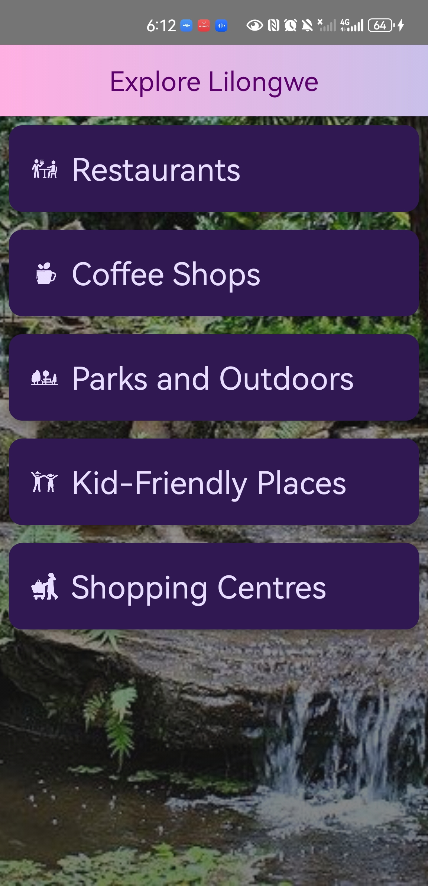

# MyCityApp - Lilongwe
The goal of this app is to show recommendations about a city based on a variety of categories. This app is a part of the <a href="https://developer.android.com/courses/android-basics-compose/course">Android Basics with Compose Course<a>

# Skills
<li> Jetpack Compose Navigation components (NavHost, NavController)
<li> Use of Jetpack Composables and elements including LazyColumn(), Card, Scaffold(),
<li> Use of ViewModel to make updates to UI state using a UDF pattern
<li> Use of Material design guidlines for color (including light/dark mode support), adaptive design and navigation

# Screenshots

  
  
  

